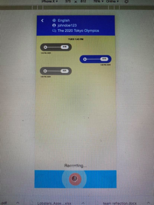

## CS 330 Final Report

### Section 66 (Language Learning) – Quinn Shim, Kevin Lee, Katherine Liu, Ah Hyun (Hannah) Kim

---

### Problem & Related Work

Non-native English speakers may be confident in reading and writing; however, they may still struggle with engaging in casual conversations and keeping up with slang/ever-evolving cultural references. This issue can be attributed to a lack of resources, lack of exposure to native speakers, and lack of motivation given their daily busy schedules. 

Current efforts can be divided into technical and non-technical solutions. Some use apps such as Duolingo or Rosetta Stone; however, real-life conversations cover broader topics, are more complex in structure, and include colloquial/slang terms that these applications do not cover in a comprehensive manner. Outside of digital platforms, meeting with a speaking coach is an effective and immersive experience; however, speaking coaches are expensive and not universally accessible. Another approach is to practice the language with close friends and family; however, from our user interviews, we saw that it was easier for non-native speakers to remain in social groups where they speak their native language. This makes it difficult to find a space to practice conversations in different languages as well as limiting interaction with native speakers- an effective way to practice a language.

Some institutions such as Northwestern University provide English Learning programs that include group language learning classes, office hours, tutoring, online training, classes, and language tables. These language tables are designed to create spaces to meet new people for informal and casual conversations – ideally to support and facilitate conversation amongst non-native English speakers with varying proficiency levels. There are several problems with these resources. The language tables and other programs have limited marketing material, making them unknown to the majority of students. Additionally, these events are infrequent – as they are only offered twice a quarter. In order to become more comfortable speaking a language, frequent practice is essential. 

### User Research

For research, we wanted to learn what makes a language learning/practicing app effective and engaging for an extended period of time.  While our proposed design can be used by all non-native English speakers, we interviewed and user tested college students. We learned that students who want to practice the conversational aspects of languages they are not native-speakers of need a comfortable and judgement-free space in order to do so. One participant expressed that not being able to understand the other person in conversation is a major factor in unwillingness to participate in a conversation , as it can be embarrassing to display a lack of comprehension. Another participant showed discontent with existing solutions because they were too complicated and didn’t allow for customized content. He added that the one language practicing app he has consistently used was the simplest.  

Through this research, we identified that our proposed design must be simple (not too feature-heavy), friendly, time-efficient, and flexible to the user’s schedule. We also decided to make it entirely anonymous with the intent of providing a judgement-free space to practice a language. The proposed app will allow users to choose the topic they want to talk about then randomly match them with a native speaker of the language they are trying to improve upon. They will then be directed to a chat interface where they will send voice messages to who they end up getting matched with. Both sides of the conversation will have the opportunity to provide feedback to the other: users practicing a language will receive feedback on their speaking abilities and users who are coaching these speakers will receive feedback on how helpful they were in the conversation. 

The various users we envision using our app are non-native speakers of English interested in practicing their conversational English and/or native English speakers interested in practicing their conversational skills in another language. Both groups are in their 20s or early 30s (relatively young, in college or working) and have a basic understanding of the language they desire more practice in. Because we are working under the assumption that the great majority of users will own smartphones, both groups will need some way to record their voice. 

### Paper Prototyping

[Video of our paper prototype in action](https://vimeo.com/391038108)

Most of our usability issues were around our chatting interface. The major pain point was the amount of information presented - users were confused about who they were talking to, what they were supposed to be talking about, and what language they were supposed to be speaking in. Some were unsure about whether they had to hold the voice button down while talking or just hit it once to begin recording. 

The rest of the application seemed to be relatively straightforward for users: the registration process, user search process, and the feedback screens (both giving and receiving) seemed clear and did not require further instructions. One user seemed unsure as to how many topics they needed to have selected before searching. 

From here, we decided to include more information and figure out how to present the additional details in an efficient way that doesn't overwhelm the user. We also need to consider how to make the chatting interface clearer (e.g holding the voice button). 

### High Fidelity Prototyping

At this stage, the tasks we are supporting are logging in, viewing and editing a user profile, starting a new conversation, and sending voice messages with another user. 

*Task 1: Logging in*

This task is very straightforward. For this assignment, we are assuming that the user already has an account so they can type in their login credentials and continue using the app.

*Task 2: View/Edit User Profile*

  

After logging in, users will see their ongoing/past messages. The user can click on the person icon at the top right corner to go to their profile page. From here, they can edit their details by clicking “Edit Profile”. This allows users to change their basic information in addition to selecting which language they want to practice. 

*Task 3: Starting a New Conversation*

  
  

From the messages inbox, users can click into ongoing and past conversations. They can also start a new conversation. If a user wanted to start a new conversation to practice a language, they would click the blue icon to the right of “Practicing”. This will lead them to the New Conversation screen where they can type a subject matter into the search bar or choose from a preexisting selection of frequently talked about topics. Once they hit begin, they will see a loading screen that lets them know that the app is pairing with them with another user who is a native speaker of the language they want to practice who also wants to talk about the same subject.

*Task 4: Send voice message*

    

To send a voice message, the user would press and hold the record button at the bottom of the screen. Once the user releases the button, they can preview the entire message. If they wish to re-record, they can do so by hitting the X button. If they are satisfied, they can hit the green check button to send the message.

Three components we decided to support are user profiles, social interactions, and branding. For user profiles, as mentioned earlier, we wanted to give users the ability to check and edit their profile information. We intentionally designed user profiles with very little personal information (including lack of a profile picture) because we were concerned that the app could potentially turn into Tinder or Omegle. The social interactions component consist of the messaging interface where matched users would send voice messages to each other in order to practice a language. As for branding, we wanted to focus on our color scheme in order to unify our interface as well as design a fitting logo fitting to our app. We came up with specific colors that were clean, simple, and demonstrated the values behind our app: simplicity, approachability, and safety. We chose to go with the bright blue because it gave off a friendly feeling and is commonly used with other educational applications. The other colors selected have been chosen based on how compatible it was with this primary blue color using Coolors.co.
 
### Reflections

In the time we had, we designed a high level overview of how we want users to navigate our application and built a visual interface to match it. We iterated through many different user workflows and were forced to question many of our prior assumptions regarding the problem domain of language learning. 

If we had more time, our next steps would be to improve our interface for separating the learning and coaching aspects of our app. As of right now, we just have the message inbox split into two sections, but we are not satisfied with this design, as it does not scale well with inbox size. We would also like to implement other necessary aspects of the application (signup, voice recording).

### Links

[Our GitHub repository](https://github.com/CS-330-Language-Learning/language-learning/tree/project_8)

[A working version of our prototype](https://cs-330-language-learning.github.io/language-learning/login.html)

Our app is best viewed in Google Chrome using the iPhone X view (which can be changed in Developer Tools). You will log in as our sample user Billy Johnson with the following credentials

**Username:** billyjohnson

**Password:** password2

You will then start a new conversation (none of the existing conversations will take you to a chatroom). 
